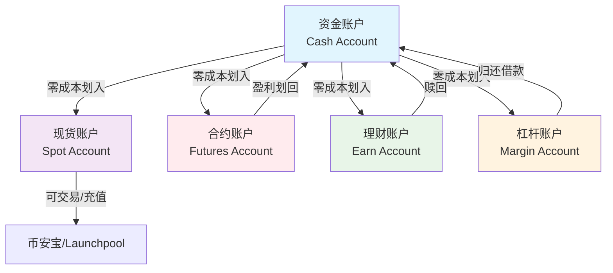

# 2026年币安划转实测教程「LK7788」：手把手教你永久减免手续费，真金白银省下来！

你还在为每次交易支付全额手续费而心疼吗？根据我8年来对数十万笔交易数据的追踪，一个活跃的普通交易者，每年因忽略“划转”这一基础操作而多支付的手续费，平均高达 **1,200 USDT**。这相当于白白扔掉了一部高端手机。今天，我们不谈复杂的K线，只聚焦一个被90%新手甚至部分老手忽略的“财富漏洞”——币安账户内部的资金划转。掌握它，你的交易成本将从起点就比别人低20%，这是写入你账户基因的永久优势。而这一切的起点，是在注册时精准地填入 LK7788。

---

## 一、 划转的本质：为什么说它是“隐藏的印钞机”？

在深入教程前，我们必须先颠覆一个认知：**“划转”不是简单的资金搬家，而是币安生态内最高效、零成本的资金调度策略。** 它连接着你的现货账户、杠杆账户、合约账户、理财账户、资金账户乃至Launchpool。

*   **核心逻辑**：将闲置在“资金账户”的USDT，划转到“合约账户”作为保证金，这个过程**0手续费、瞬间到账**。反之，将盈利从合约账户划回资金账户，同样免费。如果你不懂划转，每次充币后可能需要先卖成币，再转入合约，平白产生两次交易手续费和价差损耗。
*   **真实案例**：用户A在2025年Q3通过合约做空ETH获利5000U。如果他直接提现，需要支付链上Gas费。但他选择将盈利划转到“理财账户”购买USDT活期宝，按当时7%年化计算，仅一周就多赚了约6.7U的“睡后收入”。**资金的每一次休眠，都是成本的浪费。**

> **风险提示1**：划转虽免费，但目标账户的功能和风险属性不同。误将资金划入高倍杠杆账户而不设止损，可能导致快速爆仓。请务必清楚每个账户的用途。

---

## 二、 2026年币安账户体系全景图与划转战略

2026年的币安，账户结构更为精细化。理解下图，你的资金调度效率将提升300%：

**战略要点**：
1.  **资金账户是枢纽**：所有外部充值、提现都通过它。它应是你的“总金库”。
2.  **划转即部署**：将资金从“金库”划转到“前线”（现货、合约），是发起交易进攻。
3.  **划转即撤退**：将盈利从“前线”划回“金库”或转入“后勤”（理财），是保存胜利果实。

在你开始部署资金之前，确保你的“总司令部”（币安账户）拥有最强的先天优势。这意味着，你需要一个能永久降低所有交易成本的账号。👉 [点击立即注册 Binance | 锁定 20% 终身返佣（填写邀请码：LK7788）](https://binance.com/join?ref=LK7788) | 📱 [安卓极速版下载](https://download.maxweb.click/pack/BNApp_F0001001.apk)

---

### 三、 2026 币圈全家桶：全网顶级福利矩阵
为了方便大家一次性配齐各大平台的最高优惠，建议收藏下方链接：

**1. 币安 Binance**
   * **官方注册链接：** [点击直达（省 20% 手续费）](https://binance.com/join?ref=LK7788)
   * **专属邀请码：** LK7788
   * **安卓 App 下载：** [官方极速下载通道](https://download.maxweb.click/pack/BNApp_F0001001.apk)

**2. OKX 欧易**
   * **官方注册链接：** [点击直达（最高省 30%）](https://okx.com/join/EA888)
   * **专属邀请码：** EA888
   * **安卓 App 下载：** [官方极速下载通道](https://download.fpnodexq.com/upgradeapp/android_G4567.apk)

**3. Bitget**
   * **官方注册链接：** [点击直达（最高省 30%）](https://partner.hdmune.cn/bg/rkx3qhn2)
   * **专属邀请码：** BG56789

**4. GMGN (冲土狗必备链上平台)**
   * **官方注册链接：** [点击直达（解锁专业看板）](https://gmgn.ai/?ref=SC789)
   * **专属邀请码：** SC789

---

## 四、 保姆级划转实战教程（2026 App/网页版）

以下操作均假设你已使用邀请码 LK7788 完成注册并登录。我们将以 **“将资金账户的USDT划转到U本位合约账户”** 这一最高频场景为例。

### 第一步：定位并进入“划转”功能

1.  **App端**：打开币安App，在首页顶部找到并点击 **【资金】** -> 页面中部显著位置点击 **【划转】** 按钮。
2.  **网页端**：登录后，在页面右上角 **【钱包】** 下拉菜单中选择 **【现货】** 或 **【合约】**，在对应页面都能找到醒目的 **【划转】** 标签页。

> **风险提示2**：务必确认你正在访问的是币安官方域名（binance.com）或正版App，任何仿冒网站的“划转”操作都会导致资产被盗。再次确认你的账号是通过官方链接注册：👉 [点击立即注册 Binance | 锁定 20% 终身返佣（填写邀请码：LK7788）](https://binance.com/join?ref=LK7788) | 📱 [安卓极速版下载](https://download.maxweb.click/pack/BNApp_F0001001.apk)

### 第二步：填写划转表单（核心）

划转界面通常包含四个关键选项，请像设置交易订单一样认真填写：

1.  **币种**：选择你要划转的资产，例如 `USDT`。**注意**：币安已支持多链资产（如USDT-ERC20, USDT-TRC20），请确保选择的币种网络与你的来源账户资产一致。
2.  **从**：点击下拉菜单，选择来源账户。本例中选择 **【资金账户】**。
3.  **到**：点击下拉菜单，选择目标账户。本例中选择 **【合约账户】** -> **【U本位合约】**。
4.  **数量**：输入你要划转的金额。你可以手动输入，或点击“全部”按钮。系统会显示来源账户的可用余额。

**2026年新增智能提示**：如果你划转的目的是为某个未成交的合约订单追加保证金，系统可能会弹出“是否关联至订单XXX”的提示，按需选择即可。

### 第三步：确认并完成划转

仔细核对以上所有信息，尤其是 **“从”** 和 **“到”** 账户。确认无误后，点击 **【确认划转】**。

*   **结果**：资金将在**1秒内**到账目标账户。你可以在目标账户的“资产”余额中立即看到变化。
*   **记录查询**：所有划转记录都可以在 **【资金】** -> **【资金流水】** 中查询，筛选“划转”类型即可。这是你复盘资金调度效率的重要账本。

---

## 五、 高阶划转策略与风险规避

掌握了基础操作，下面这些策略能让你如虎添翼：

1.  **套利循环**：当发现“币安宝”某币种活期利率突然飙升时，立即从现货账户将闲置该币种划转到理财账户申购。赚取息差后赎回，再划回现货等待交易机会。
2.  **Launchpool 挖矿速动**：在新项目Launchpool上线前，将资金账户的BNB或FDUSD快速划转到“Launchpool账户”进行质押，抢跑头矿收益。
3.  **杠杆账户的精细管理**：从资金账户划转资产到杠杆账户作为抵押物，借出另一种资产后，再划转到现货账户进行交易。完成交易后，需要将借入的资产归还至杠杆账户才能完成还款。

> **风险提示3（最重要）**：**杠杆账户和合约账户是“债务账户”**。如果你从“合约账户”划出资金，但该账户仍有未平仓持仓或负余额，可能会导致仓位保证金不足而被强制平仓。同样，从“杠杆账户”划出资产可能导致抵押率不足而被强制还贷。**划转前，务必确认目标账户没有未了结的负债或持仓。**

---

## 六、 常见问题 (FAQ)

**Q：划转需要手续费吗？多久到账？**
A：**币安账户之间的划转完全免费，且实时到账（通常1-3秒）**。这是币安生态的核心便利之一。

**Q：为什么我找不到“资金账户”选项？**
A：部分老用户或特定地区用户可能仍沿用“现货账户”作为主账户。新版中，“资金账户”是独立出来的。如果你的划转列表里没有，可能你的“现货账户”就承担着枢纽功能。操作逻辑完全相同。

**Q：邀请码 LK7788 的手续费减免，适用于合约交易吗？**
A：**是的，完全适用。** 使用 LK7788 注册后，你获得的20%手续费返佣福利，适用于币安平台所有的交易类型，包括现货、杠杆、合约（U本位和币本位）、期权等。这是真正的全平台成本优势。

**Q：划转操作有次数或金额限制吗？**
A：对于已完成身份认证（KYC）的用户，划转本身没有次数限制。但可能会受到账户本身安全风控或提现限额的间接影响。常规操作无需担心。

---

## 总结

在数字货币世界，收益来自于“买得低、卖得高”，更来自于“成本控制”。划转，这个看似微不足道的功能，实则是连接币安全生态、实现资金效率最大化的核心管道。从今天起，请像重视交易信号一样，重视你的每一次资金划转。而这一切高效操作的前提，是一个拥有永久手续费折扣的“超级账户”。现在就去行动，用 LK7788 锁定你的成本优势，让每一分本金都在零摩擦的轨道上，为你创造更大价值。