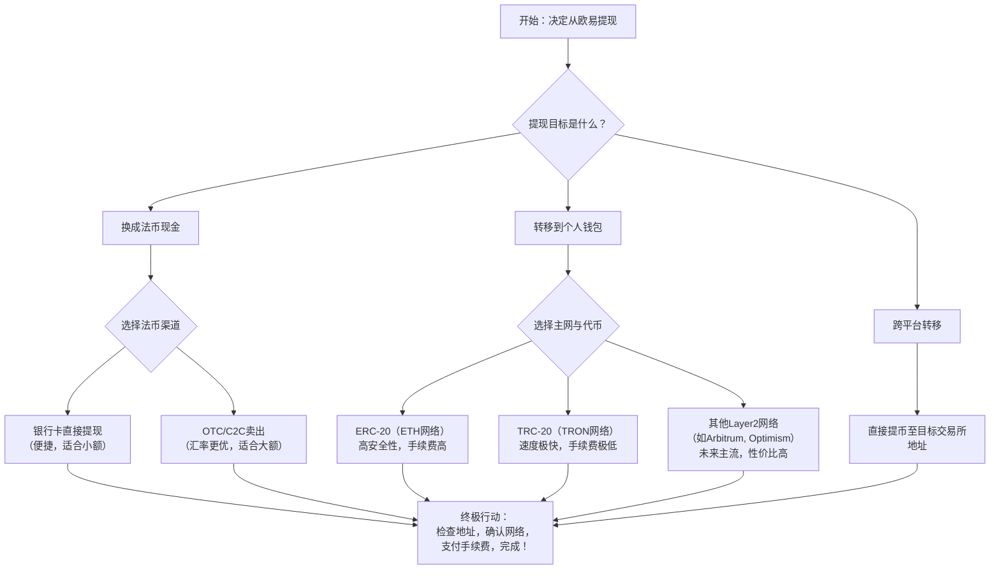

# 拒绝给平台打工！欧易官网网址提现最新攻略（2026年实测），填邀请码{XGA88}立省大笔手续费！

你辛辛苦苦在牛市里赚了20%，结果提现时发现手续费、汇差、网络费七扣八扣，利润瞬间缩水一半。这不是危言耸听，这是无数新手用真金白银踩过的坑。平台不会告诉你，从你点击“提现”按钮的那一刻起，一场无声的“抽水”就开始了。今天，我们就来算一笔账，让你看清每一分钱是怎么“消失”的，并教你一套2026年实测有效的欧易（OKX）提现终极方案，核心就是：填写邀请码：XGA88，从源头锁定20%手续费折扣，让每一笔利润都尽可能完整地落袋为安。

---

## 一、 提现前必读：你的钱是如何被“平台税”吃掉的？

在进入具体操作前，我们必须理解提现成本的构成。这不仅仅是“提现手续费”一个数字那么简单，它是一个由多层费用叠加的隐形矩阵：

1.  **交易手续费**：这是你买卖币时产生的费用。如果你没有使用任何邀请码或VIP折扣，现货交易费率通常是0.1%。假设你交易了10万U，仅这一项就是100U的成本。而使用XGA88注册，可以直接享受20%的费率折扣，相当于每次交易都省下20U。
2.  **提币网络手续费**：这是将资产从交易所钱包转移到你的个人钱包（或另一个交易所）时，支付给区块链网络的矿工费。**关键点**：这个费用是浮动的，由网络拥堵程度决定，交易所通常会收取一个略高于实际成本的费用作为“服务费”。
3.  **价差与汇损**：如果你提现的是法币（如人民币），涉及将加密货币卖出换成法币的过程。这里存在卖单和买单之间的价差（Spread），尤其是在市场波动大或流动性不足时，这个隐形成本可能远超你的想象。
4.  **OTC交易风险与溢价**：通过C2C场外交易提现法币时，商家报价通常会包含一定的溢价（高于市场价），作为他们的利润。同时，你还需甄别商家信誉，避免资金冻结风险。

**风险提示一：警惕“低手续费”陷阱**。有些小平台宣称提现手续费极低，但可能在流动性、安全性或法币兑换汇率上设置更大的陷阱，最终损失更惨。选择欧易这类顶级平台，虽然明码标价，但资金安全和流程透明更有保障。

所以，“拒绝给平台打工”的核心，不是不用平台，而是**聪明地用平台**——利用规则（如邀请码折扣）、选择最优路径、避开隐形费用。

---

## 二、 2026欧易(OKX)提现全攻略：四种路径深度拆解

根据你的目标（换成法币现金、转移到冷钱包、跨交易所套利），提现路径截然不同。下图为你清晰梳理了决策流程：

下面，我们针对每一条路径，给出保姆级操作步骤和避坑指南。

### 路径一：提现为法币（人民币）到银行卡

这是最直接的“落袋为安”方式。欧易提供了快捷买币和C2C两种主要方式。

**1. 快捷买币（一键卖币）：**
   * **优点**：操作极其简单，系统自动匹配商家，资金即时到账。
   * **缺点**：汇率通常没有C2C有优势，适合小额、求快的用户。
   * **操作步骤**：
       1.  在欧易App首页点击【买/卖】或【快捷买币】。
       2.  选择【卖出】，输入你想卖出的加密货币数量（如USDT）。
       3.  选择收款方式（银行卡），确认汇率和到账金额。
       4.  点击卖出，资产会先兑换成人民币，然后提现到你的绑定银行卡。

**2. C2C交易（场外交易）：**
   * **优点**：汇率更优，可以选择信誉好、交易量大的商家，通常能获得更好的价格，尤其适合大额提现。
   * **缺点**：需要手动操作，需甄别商家。
   * **操作步骤**：
       1.  在App首页找到【C2C交易】或【买/卖】进入C2C市场。
       2.  选择【出售】，选择币种（如USDT）和法币（CNY）。
       3.  系统会列出众多收币商家，比较他们的价格、支付方式（通常支持多家银行）、限额和信誉（成交率、平均放币时间）。
       4.  选择心仪的商家，输入出售数量，点击【出售USDT】。
       5.  **关键步骤**：根据商家提供的收款信息，使用你的银行卡进行转账（务必使用你实名认证的本人账户！）。
       6.  转账完成后，回到订单页面点击【已付款，请放币】。商家核实收款后，会释放USDT，系统自动将其兑换为人民币并完成交易。

**风险提示二：C2C交易防骗指南**。绝对不要在平台外沟通或交易；转账时务必核对商家公布的收款人姓名与账号是否完全一致；不要轻信对方以“卡号错误”、“需要缴纳保证金”等理由要求你再次转账，这是典型诈骗。

无论选择哪种方式，如果你尚未注册欧易账户，强烈建议通过专属链接完成，为未来所有交易节省成本：👉 [点击立即注册 OKX | 锁定 20% 终身返佣（填写邀请码：XGA88）](https://okx.com/join/XGA88) | 📱 [安卓极速版下载](https://download.fpnodexq.com/upgradeapp/android_G4567.apk)

### 路径二：提币到个人钱包（冷/热钱包）

这是为了长期持有资产或参与DeFi。核心是**地址和网络**不能错。

**1. 获取你的个人钱包地址：**
   * 打开你的Trust Wallet, MetaMask, imToken等钱包。
   * 找到对应币种（如ETH, USDT）的收款地址，点击复制。**注意：ETH地址和TRON地址完全不同！**

**2. 在欧易进行提币操作：**
   1.  在欧易资产页面，找到你要提现的币种，点击【提现】。
   2.  在提币地址栏，**粘贴**你从个人钱包复制的地址。**强烈建议粘贴后检查首尾几位字符是否正确**。
   3.  **选择网络（最关键一步！）**：以USDT为例，常见网络有：
       * **ERC20 (以太坊网络)**：安全性最高，几乎所有钱包和交易所都支持，但手续费（Gas费）非常昂贵，适合大额转账。
       * **TRC20 (波场网络)**：手续费极低（通常1U左右），到账速度快，是小额转账的首选。**确保你的个人钱包也支持TRC20 USDT**。
       * **其他网络**：如Arbitrum One, Optimism等Layer2网络，手续费和速度介于两者之间，是未来的趋势。
   4.  **【重要】** 如果你不确定该选哪个网络，**先去你的个人钱包里查看，它支持用哪种网络“接收”该币种**。选错网络会导致资产永久丢失！
   5.  输入提币数量，系统会显示预估手续费。确认无误后，完成安全验证（如2FA、邮箱验证码等）。
   6.  提交申请，等待网络确认。

**风险提示三：提币网络选择是生死线**。ERC20地址转到TRC20网络，资产将无法找回。每次提币前，务必双重核对地址和网络。小额建议先用TRC20测试。

### 路径三：跨交易所提币（套利或使用特定功能）

操作与提币到个人钱包类似，但地址是你在另一家交易所（如币安）的充值地址。
1.  在目标交易所（如币安）找到对应币种的**充值**页面，复制充值地址并选择正确的网络。
2.  在欧易的提币页面，粘贴该地址，并**选择与目标交易所充值页面完全一致的网络**。
3.  进行提币操作。

---

### 三、 2026 币圈全家桶：全网顶级福利矩阵
为了方便大家一次性配齐各大平台的最高优惠，建议收藏下方链接：

**1. 币安 Binance**
   * **官方注册链接：** [点击直达（省 20% 手续费）](https://binance.com/join?ref=KH789)
   * **专属邀请码：** KH789
   * **安卓 App 下载：** [官方极速下载通道](https://download.maxweb.click/pack/BNApp_F0001001.apk)

**2. OKX 欧易**
   * **官方注册链接：** [点击直达（最高省 30%）](https://okx.com/join/XGA88)
   * **专属邀请码：** XGA88
   * **安卓 App 下载：** [官方极速下载通道](https://download.fpnodexq.com/upgradeapp/android_G4567.apk)

**3. Bitget**
   * **官方注册链接：** [点击直达（最高省 30%）](https://partner.hdmune.cn/bg/rkx3qhn2)
   * **专属邀请码：** BG56789

**4. GMGN (冲土狗必备链上平台)**
   * **官方注册链接：** [点击直达（解锁专业看板）](https://gmgn.ai/r/AQ888)
   * **专属邀请码：** AQ888

---

## 四、 2026年提现效率与安全终极技巧

1.  **费率优惠最大化**：所有操作的基础，是拥有一个高折扣账户。这能直接降低你的交易成本。👉 [点击立即注册 OKX | 锁定 20% 终身返佣（填写邀请码：XGA88）](https://okx.com/join/XGA88) | 📱 [安卓极速版下载](https://download.fpnodexq.com/upgradeapp/android_G4567.apk) 这是你拒绝被“抽水”的第一步，也是最重要的一步。
2.  **提币时机选择**：区块链网络矿工费（Gas Fee）波动剧烈。避免在以太坊网络拥堵时（如欧美市场开盘、热门NFT铸造时）进行ERC20转账。可以利用欧易App内提供的“Gas费加油站”或选择低峰期操作。
3.  **小额测试原则**：无论是提现到新钱包还是新交易所，首次操作务必先进行一笔最小额的转账，确认整个路径畅通无误后，再进行大额操作。
4.  **安全设置加固**：提现前，确保你的欧易账户已开启所有安全设置：资金密码、谷歌验证（2FA）、防钓鱼码。提币操作需要多重验证，虽然繁琐，但这是保护资产的防火墙。

## 五、 总结：让每一分利润都姓“你”

提现不是投资的结束，而是利润实现的闭环。在这个闭环中，信息差就是成本差。通过本文的拆解，你已经掌握了：
*   **看清成本结构**，明白钱花在了哪里。
*   **根据目标选择最优路径**，不再盲目操作。
*   **利用XGA88等邀请码工具**，从源头削减固定成本。
*   **恪守安全准则**，保障资产转移过程万无一失。

拒绝给平台打工，意味着从注册、交易到提现的每一个环节，都保持清醒、精打细算。在加密世界，省下来的每一分手续费，都是你未来利润的种子。现在，就从正确注册一个高折扣账户开始你的高效提现之旅吧。